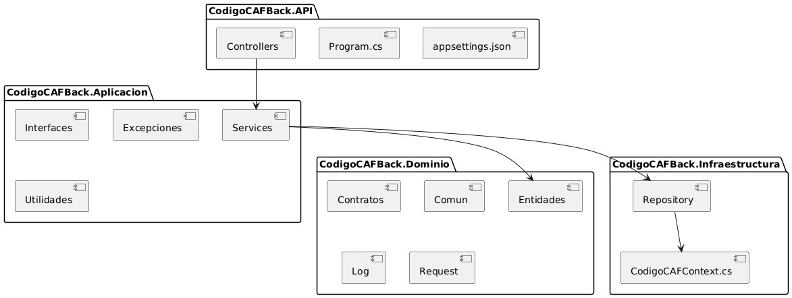

# Código CAF BACK

## Descripción
Este proyecto es una API RESTful desarrollada en .NET Core 9 que proporciona las APIs para realizar todas las consultas y transacciones sobre el modelo financiero que se maneja en Código CAF.

## Instalación
Para realizar la instalación del proyecto, se debe continuar con los siguientes pasos
1. Clona el repositorio:
    ```bash
    git clone https://gitlab.com/caf6555111/codigocaf_back.git
2. Restaura las dependencias: 
    ```bash
    dotnet restore
3. Compila el proyecto:
    ```bash
    dotnet build
4. Ejecuta la API:
    ```bash
    dotnet run

## Arquitectura
El proyecto sigue una **arquitectura hexagonal**, que organiza el código en capas, promoviendo la escalabilidad y el mantenimiento mediante la separación de la lógica del dominio. A continuación, se describe su estructura principal:

```
CodigoCAFBACK
    ├── CodigoCAFBack.API
    │   ├── Controllers
    │   │   └── DominioController
    │   ├── Program.cs
    │   └── appsettings.json
    ├── CodigoCAFBack.Aplicacion
    │   ├── Excepciones
    │   │   └── ExcepcionesPersonalizadas
    │   ├── Interfaces
    │   │   └── Interfaces
    │   ├── Services
    │   │   └── Implementaciones
    │   └── Utilidades
    │       └── UtilidadesComunes
    ├── CodigoCAFBack.Dominio
    │   ├── Comun
    │   │   └── ClasesTransversales
    │   ├── Contratos
    │   │   └── ModelosInteracciónSP
    │   ├── Entidades
    │   │   └── EntidadesDB
    │   ├── Log
    │   │   └── ImplementaciónLog
    │   └── Request
    │       └── RequestAplicacion
    ├── CodigoCAFBack.Infraestructura
    │   ├── Repository
    │   │   └── ImplementaciónRepository
    │   └── CodigoCAFContext.cs
    └── README.md
```
#### 1. **CodigoCAFBack.API**
CodigoCAFBack.API es el proyecto principal dentro de la solución que actúa como la capa de presentación de la arquitectura hexagonal. Su propósito es exponer las funcionalidades del sistema a través de una API RESTful, permitiendo la interacción con el modelo financiero de Código CAF.
##### 1.1 **Controllers**
Los controladores son responsables de manejar las solicitudes HTTP entrantes y delegar la lógica de negocio a las capas internas (como Aplicacion o Dominio). Cada controlador se encarga de una entidad específica del sistema, como DominioController, que gestiona las operaciones relacionadas con el dominio financiero.
##### 1.2 **Program.cs**
El archivo Program.cs es el punto de entrada de la aplicación. Aquí se configuran los servicios, middleware y la infraestructura necesaria para que la API funcione correctamente. Este archivo también define la configuración del servidor web y la inicialización de la aplicación.
##### 1.3 **appsettings.json**
El archivo appsettings.json almacena configuraciones clave, como cadenas de conexión a la base de datos, configuraciones de logging, y otros parámetros necesarios para la ejecución de la API

#### 2. **CodigoCAFBack.Aplicacion**
CodigoCAFBack.Aplicacion es la capa de lógica de negocio dentro de la arquitectura hexagonal del proyecto. Su propósito principal es implementar las reglas de negocio y coordinar las interacciones entre la capa de presentación (CodigoCAFBack.API) y la capa de dominio (CodigoCAFBack.Dominio).
##### 2.1 **Excepciones**
La carpeta Excepciones contiene clases que definen excepciones personalizadas para manejar errores específicos en la aplicación. Estas excepciones permiten una gestión más clara y controlada de los errores que pueden ocurrir durante la ejecución del sistema.
##### 2.2 **Interfaces**
Define contratos (Interfaces) que deben ser implementados por las clases de servicios o repositorios, asegurando un bajo acoplamiento y facilita la inyección de dependencias, permitiendo cambiar implementaciones sin afectar otras partes del sistema.
##### 2.3 **Services**
Contiene las clases que implementan las interfaces definidas en Interfaces de los servicios que son responsables de coordinar las operaciones entre las capas y aplicar las reglas de negocio.
##### 2.4 **Utilidades**
La carpeta Utilidades contiene clases y métodos comunes que pueden ser utilizados en diferentes partes de la aplicación. Esto incluye funciones auxiliares, validaciones, y otras utilidades que no pertenecen a una lógica de negocio específica.

#### 3. **CodigoCAFBack.Dominio**
CodigoCAFBack.Dominio es la capa que encapsula el núcleo del sistema, representando el modelo del dominio financiero de Código CAF. Su objetivo principal es definir las entidades, contratos y lógica transversal que reflejan las reglas y conceptos del negocio, manteniéndose independiente de las demás capas.
##### 3.1 **Comun**
Contiene clases transversales (ClasesTransversales) que son reutilizables en diferentes partes del dominio. Estas clases pueden incluir constantes, enumeraciones o utilidades específicas que son comunes en el modelo del dominio.
##### 3.2 **Contratos**
Define los contratos (ModelosInteracciónSP) que representan la interacción entre la aplicación y la base de datos. Estos contratos son utilizados para mapear los datos entre las entidades del dominio y las tablas de la base de datos, facilitando la comunicación entre las capas.
##### 3.3 **Entidades**
Contiene las entidades (EntidadesDB) que representan los objetos del dominio financiero. Estas entidades son las clases que reflejan los conceptos y reglas del negocio, y son utilizadas por la capa de aplicación para realizar operaciones sobre el modelo financiero.
##### 3.4 **Log**
La carpeta Log contiene la implementación del logging para la aplicación. Esto incluye configuraciones y clases que permiten registrar eventos, errores y otra información relevante durante la ejecución del sistema. Un buen manejo de logs es crucial para el monitoreo y la depuración de la aplicación.
##### 3.5 **Request**
La carpeta Request contiene las clases que representan las solicitudes (RequestAplicacion) que se envían a la aplicación. Estas clases son utilizadas para encapsular los datos necesarios para realizar operaciones específicas en el sistema, facilitando la comunicación entre la capa de presentación y la capa de aplicación.

#### 4. **CodigoCAFBack.Infraestructura**
CodigoCAFBack.Infraestructura es la capa responsable de la interacción con la base de datos y otros recursos externos. Su objetivo principal es proporcionar implementaciones concretas para las interfaces definidas en la capa de aplicación, permitiendo el acceso a los datos y la persistencia de las entidades del dominio.
##### 4.1 **Repository**
La carpeta Repository contiene las implementaciones concretas de los repositorios que interactúan con la base de datos. Estos repositorios son responsables de realizar operaciones CRUD (Crear, Leer, Actualizar, Eliminar) sobre las entidades del dominio y encapsulan la lógica de acceso a datos.
##### 4.2 **CodigoCAFContext.cs**
El archivo CodigoCAFContext.cs define el contexto de la base de datos utilizando Entity Framework Core. Este contexto es responsable de gestionar la conexión a la base de datos y mapear las entidades del dominio a las tablas correspondientes en la base de datos. También incluye configuraciones específicas para la inicialización y migraciones de la base de datos.



## Uso
Una vez que la API esté en ejecución, puedes interactuar con los endpoints utilizando herramientas como Postman o cURL. Asegúrate de configurar correctamente las cadenas de conexión en el archivo `appsettings.json`.

## Flujo Típico
El flujo típico para CodigoCAFBack sigue los principios de la arquitectura hexagonal, donde las solicitudes entrantes pasan por varias capas (API, Aplicación, Dominio e Infraestructura) para procesar la lógica de negocio y devolver una respuesta. A continuación, se describe el flujo general:
---
1. Solicitud HTTP desde el cliente
•	Un cliente (por ejemplo, Postman, navegador o una aplicación externa) realiza una solicitud HTTP (GET, POST, PUT, DELETE) a un endpoint expuesto por la API.
---
2. Capa de Presentación (CodigoCAFBack.API)
•	Controlador: El controlador correspondiente (por ejemplo, DominioController) recibe la solicitud.
•	Valida los datos de entrada (si es necesario).
•	Llama a un servicio de la capa de aplicación para delegar la lógica de negocio.
---
3. Capa de Aplicación (CodigoCAFBack.Aplicacion)
•	Servicio: El servicio correspondiente procesa la solicitud.
•	Aplica las reglas de negocio.
•	Si es necesario, interactúa con la capa de dominio para obtener o manipular datos.
•	Si requiere persistencia o consulta de datos, delega la operación a la capa de infraestructura.
---
4. Capa de Dominio (CodigoCAFBack.Dominio)
•	Entidades: Las entidades encapsulan las reglas del negocio y realizan validaciones específicas.
•	Contratos: Si se necesita interactuar con procedimientos almacenados o estructuras específicas, se utilizan los contratos definidos en esta capa.
•	Lógica transversal: Se aplican operaciones comunes o transversales, como logging o manejo de solicitudes.
---
5. Capa de Infraestructura (CodigoCAFBack.Infraestructura)
•	Repositorio: Los repositorios implementan las operaciones de acceso a datos (CRUD) utilizando el contexto de base de datos (CodigoCAFContext.cs).
•	Realizan consultas o actualizaciones en la base de datos.
•	Devuelven los datos necesarios a la capa de aplicación.
---
6. Respuesta al cliente
•	La capa de aplicación devuelve los datos procesados al controlador en la capa de presentación.
•	El controlador construye la respuesta HTTP (por ejemplo, un objeto JSON) y la envía al cliente.
---
Ejemplo de Flujo
1.	Solicitud: Un cliente realiza una solicitud GET /api/dominio para obtener información del dominio financiero.
2.	Controlador: DominioController recibe la solicitud y llama al servicio DominioService.
3.	Servicio: DominioService aplica las reglas de negocio y solicita datos al repositorio DominioRepository.
4.	Repositorio: DominioRepository consulta la base de datos a través de CodigoCAFContext.
5.	Respuesta: Los datos se devuelven al servicio, luego al controlador, y finalmente al cliente en formato JSON.

